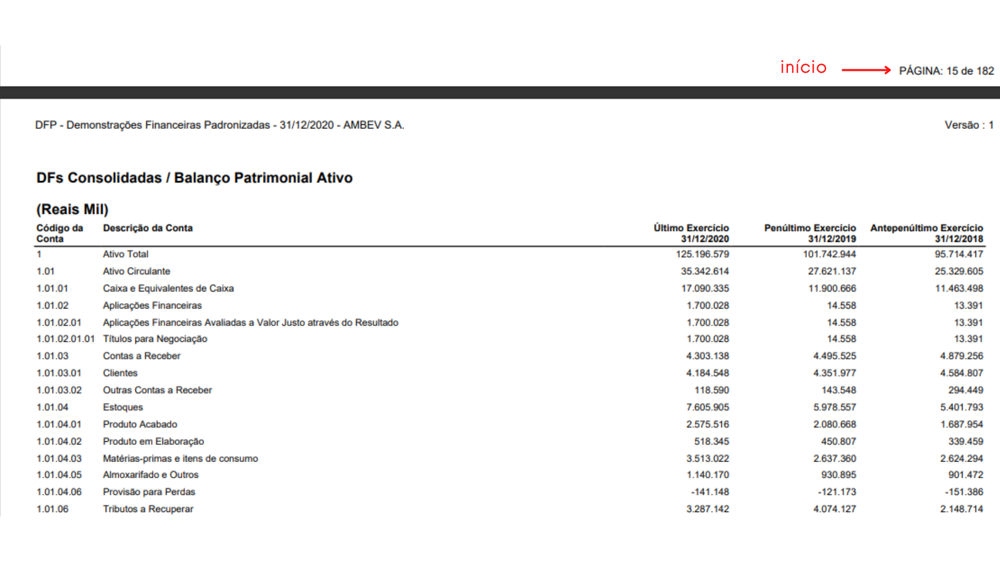
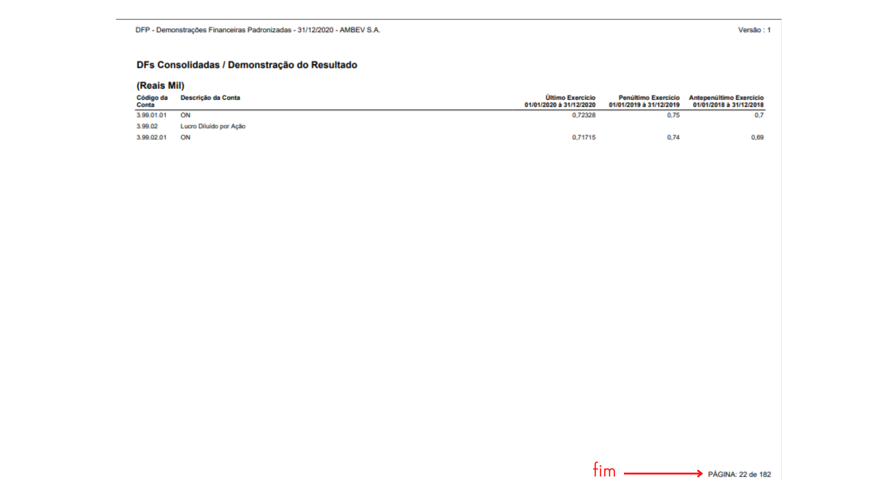

# Análise Contábil e Financeira de Empresas

Projeto baseado na disciplina **Análise Contábil e Financeira de Empresas** do curso de Ciências Econômicas na UNESP de Araraquara.

Como avaliação da disciplina, nós deveríamos realizar uma Análise Fundamentalista de alguma empresa listada na bolsa de valores B3. A empresa é de escolha do grupo, mas o período de análise deve ser de 3 anos.

Os índices utilizados se dividiam em 4 categorias:

<details>
<summary>Estrutura de Capital</summary>
    
    - Participação de Capital de Terceiros
    
    - Composição do Endividamento
        
    - Imobilização do Patrimônio Líquido  
        
    - Capital Circulante Próprio (CCP)
        
    - Capital Circulante Líquido (CCL)
            
    - Imobilização de Recursos Não Correntes
</details>

<details>
<summary>Liquidez</summary>
    
    - Liquidez Geral
    
    - Liquidez Corrente
    
    - Liquidez Seca
</details>

<details>
<summary>Rentabilidade</summary>
    
    - Giro do Ativo
    
    - Margem Líquida
    
    - Rentabilidade do Ativo (ROA)
    
    - Rentabilidade do Patrimônio Líquido (ROE)
</details>

<details>
<summary>Prazos Médios</summary>

    - Prazo Médio de Recebimento de Vendas (PMRV)
    
    - Prazo Médio de Pagamento de Contas (PMPC)
    
    - Prazo Médio de Renovação de Estoques (PMRE)
    
    - Giro do Estoque
</details>

A proposta deste projeto é desenvolver um pacote na linguagem Python que:

1. Extraia os dados dos Demonstrativos Financeiros das empresas;
2. Realize os cálculos dos índices;
3. Plote visualizações básicas.


## Como usar
Para utilizar o pacote, primeiro é necessário ter o arquivo dos **Demonstrativos Financeiros Padronizados (_DFPs_)** da empresa que deseja analisar. Eles podem ser baixados no site da B3 pelo seguinte [link](https://www.b3.com.br/pt_br/produtos-e-servicos/negociacao/renda-variavel/empresas-listadas.htm). Nele, basta inserir o nome ou _ticker_ da empresa desejada e selecioná-la. Na página resultante existe caixa de diálogo na parte superior direita que diz '_Sobre a Empresa_', selecione a opção '_Relatórios Estruturados_', selecione o ano base baixe as informações.

Com o arquivo baixado, basta procurar em qual página dele iniciam-se as _Demonstrações Financeiras **Consolidadas**_ e em qual página terminam, como no exemplo abaixo
### Início

### Fim


## Pacote
O pacote será estruturado da seguinte maneira:
```
acfe/
|-- __init__.py
|
|-- extracao.py
|
|-- indices.py
|
|-- visualizacao.py
```

### extracao.py
Contém o(s) script(s) necessário(s) para extrair os dados do arquivo `.pdf` e consolidá-los no formato de um `pd.DataFrame`.
A extração será feita por meio de expressões regulares - ***regex***.

### indices.py
Contém o script necessário para realizar o cálculo dos índices. Cada módulo é responsável pelo cálculo de uma das quatro categorias de índices, e leva o nome de sua categoria.

### visualizacao.py
Contém o script necessário para visualizar os índices.
